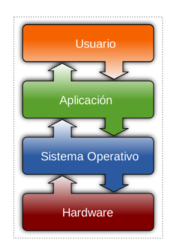
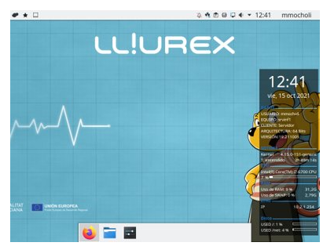



# Tipos de Sistemas Operativos

## Definición

“Un sistema operativo es el software más importante que se ejecuta en un ordenador. Gestiona la memoria del ordenador, los procesos, y todo su software y hardware. También permite que te comuniques con el ordenador sin que para ello tengas que conocer cómo funciona su propio lenguaje. Sin un sistema operativo, un ordenador sería inútil.”

## ¿Qué es un sistema operativo?

El sistema operativo es el conjunto de los distintos programas que controlan el funcionamiento de un ordenador.

## ¿Qué controla un sistema operativo?

* Controla el uso de los dispositivos del ordenador para poderlos utilizar: teclado, monitor, impresora..
* Ejecuta los programas instalados
* Organiza, almacena y recupera la información de los discos.

## ¿Qué es un sistema operativo?

Es lo primero que vemos cuando se enciende el ordenador y lo último que funciona cuando lo apagamos.

## Tipos de Sistemas Operativos

1. De pago
    + Windows
    + iOS
2. Gratuitos
    + Lliurex
    + Chrome OS
    + Ubuntu
    + Android

## Características del Sistema Operativo.​

* Fácil de utilizar, intuitivo .​
* Eficiente . Use bien y rápido los recursos.​
* Evolutivo , actualizable para poder avanzar y mejorar según las necesidades.

!!! note "cual es la correcta?"
    1. El SO controla la configuración del equipo.​
    2. El SO no puede ejecutar programas.​
    3. El SO es siempre gratuito.​
    4. El SO no evoluciona.
    
??? note "cual es la correcta? - solucion"
    1. **El SO controla la configuración del equipo.​**
    2. El SO no puede ejecutar programas.​
    3. El SO es siempre gratuito.​
    4. El SO no evoluciona.

