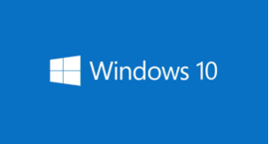
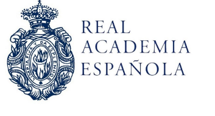

# EJERCICIOS DOSSIER

**Realizar los ejercicios en un documento nuevo de Microsoft 365 y compartirlos con el profesor**

## Ejercicio 1

-  **A:** Tengo la versión Windows 10

- **B:** Las claves genéricas de Windows son unas licencias facilitadas por la propia compañía para ofrecer la posibilidad de activar el sistema operativo sin tener que comprar una licencia oficial. Por lo tanto, nos permiten instalar, activar y utilizar Windows de forma totalmente gratis.
- **C:** No es necesario, pero si recomendable.
## Ejercicio 2

+ **A:** Lliurex, Lliurex 21.

+ **B:** Las distribuciones de Linux son sistemas operativos instalables diseñados a partir del  kernel de Linux, que admiten programas de usuarios, repositorios y bibliotecas. La versión de cada comunidad o proveedor es una distribución. Hay más de 500 distribuciones pero algunos ejemplos serian: Ubuntu, Debian, Fedora...
+ **C:** Las comunitarias son distribuciones gratuitas de Linux,

+ **D:**
	* Se puede descargar desde la página de lliurex.net.

	* En 2005, CEIP CAMPANAR.

	* Es el único sistema operativo que puede estar completamente en valenciano.

	* Que lliurex se encuentre en muchos otros lugares del mundo.

	* Todas son correctas.
## Ejercicio 3:

Una *aplicación* es un programa informático diseñado como una herramienta para realizar operaciones o funciones específicas. Si, por ejemplo: WhatsApp, Youtube, y muchas más...

## Ejercicio 4:

***GIMP*** pude ser ejecutado (aparte de Windows) en:

- Unix

- GNU/Linux

- FreeBSD

- Solaris

- macOS

## Ejercicio 5:

No, *las aplicaciones web* son aquellas que se ejecutan directamente en el navegador del móvil, sin necesidad de descargarlas ni instalarlas. 
*Las aplicaciones multiplataforma* son aquellas que se crean con un único código fuente, pero que se pueden adaptar y ejecutar en diferentes sistemas operativos.

**Traductor Google**

**Real Academia Española**

## Ejercicio 6:

**Frase 2:**  Windows es un sistema operativo basado en una interfaz gráfica cuyo elemento principal es la ventana que se puede minimizarse y redimensionarse.

**Frase 3:** Linux es un núcleo de un sistema operativo gratuito y libre basado en Unix.

**Frase 4:** Lliurex tiene como objetivo principal  la introducción de la TIC en el sistema educativo valenciano.

**Frase 5:** Las aplicaciones son programas que se ejecutan sobre un sistema operativo y que son manejadas directamente por los usuarios.

## Ejercicio 7:

| MALWARE | CARÁCTER |
|-|-|
| Virus | C |
| Gusano | E |
| Troyano | A |
| Spyware | G |
| Ransonware | D |
| Adware | B |
| Rogueware | F |

